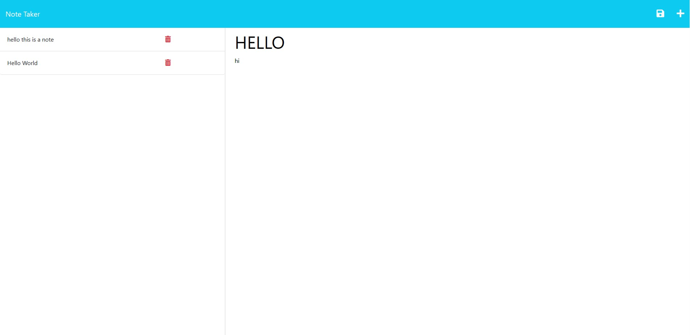

# note-taker

## Description

Provide a short description explaining the what, why, and how of your project. Use the following questions as a guide:

- What was your motivation? The motivation behind this application was too create a note taking application where you can digitally access notes and create them
- Why did you build this project? I built this project so that way when coding and if i want to make notes i can have easy access to put notes
- What problem does it solve? This solves the problem of having to use different sources to take notes where if you have some type of office job or development job you can easily put notes on   this application and save them

If your README is long, add a table of contents to make it easy for users to find what they need.

 ## image of site
 

N/A

## Usage

## Credits
credit to: Daniel, Mica, & Joey for helping with delete functions to delete notes.
N/A

## License

MIT License

Copyright (c) 2023 Lucas Wysoczanski

Permission is hereby granted, free of charge, to any person obtaining a copy
of this software and associated documentation files (the "Software"), to deal
in the Software without restriction, including without limitation the rights
to use, copy, modify, merge, publish, distribute, sublicense, and/or sell
copies of the Software, and to permit persons to whom the Software is
furnished to do so, subject to the following conditions:

The above copyright notice and this permission notice shall be included in all
copies or substantial portions of the Software.

THE SOFTWARE IS PROVIDED "AS IS", WITHOUT WARRANTY OF ANY KIND, EXPRESS OR
IMPLIED, INCLUDING BUT NOT LIMITED TO THE WARRANTIES OF MERCHANTABILITY,
FITNESS FOR A PARTICULAR PURPOSE AND NONINFRINGEMENT. IN NO EVENT SHALL THE
AUTHORS OR COPYRIGHT HOLDERS BE LIABLE FOR ANY CLAIM, DAMAGES OR OTHER
LIABILITY, WHETHER IN AN ACTION OF CONTRACT, TORT OR OTHERWISE, ARISING FROM,
OUT OF OR IN CONNECTION WITH THE SOFTWARE OR THE USE OR OTHER DEALINGS IN THE
SOFTWARE.

---

🏆